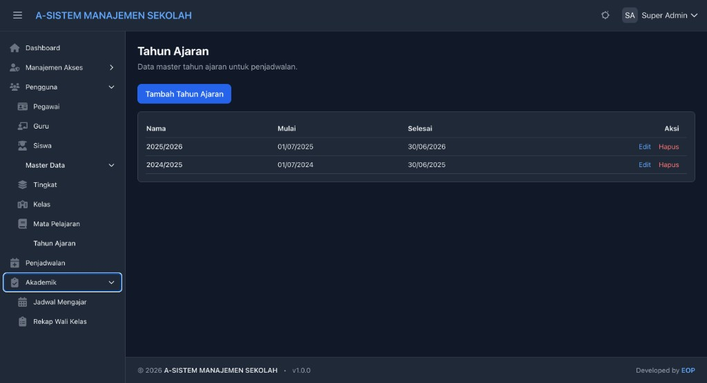

# Cuplikan layar

Dokumentasi visual singkat untuk **A-SMS Sistem Manajemen Sekolah (Simple)**.

Lihat juga [README.md](README.md) untuk pengantar dan cuplikan layar yang sama.

---

## Master Data — Tahun Ajaran

Mengelola nama tahun ajaran (misalnya `2025/2026`) beserta tanggal mulai dan selesai. Data ini dipakai saat membuat/mengedit jadwal di **Penjadwalan** dan sebagai filter di **Akademik → Jadwal Mengajar** (termasuk tahun ajaran terbaru sebagai default).
